# 🚀 AWS EKS Multi-Language GitOps CI/CD Enterprise Platform


Production-style cloud-native platform demonstrating Enterprise DevOps, GitOps, Kubernetes, Infrastructure as Code, 
Security Automation and Polyglot Microservices deployment on AWS EKS.
---

## 📚 Table of Contents

* [Overview](#Overview)
* [Architecture](#architecture)
* [Technology Stack](#technology-stack)
* [Project Structure](#project-structure)
* [Screenshots](#screenshots)
* [CI/CD Architecture](##ci/cd-architecture)
* [Security Strategy ](#security-strategy) 
* [GitOps Promotion Model](#gitops-promotion-model) 
* [Environment Promotion Flow](#environment-promotion-flow)
* [Rollback Strategy](#rollback-strategy)
* [Monitoring & Observability](#monitoring-&-observability)
* [Key Features](#key-features)
* [Architectural Decisions & Tradeoffs](#architectural-decisions-&-tradeoffs)
* [Learning Outcomes](#learning-outcomes)
* [Future Enhancements](#future-enhancements)

---

# Overview

This project demonstrates an enterprise-grade GitOps platform supporting multiple application languages deployed to Kubernetes using AWS EKS.

The platform implements:

* Infrastructure as Code with Terraform
* GitOps with ArgoCD
* Kubernetes deployments using Helm
* Environment promotion pipelines
* Automated security scanning
* Docker image lifecycle management
* Multi-language CI/CD workflows
* Enterprise deployment patterns

The project includes:

* React Dashboard
* JavaScript API (Node.js)
* Java Spring Boot Service
* Rust Processor Service

---

# Architecture

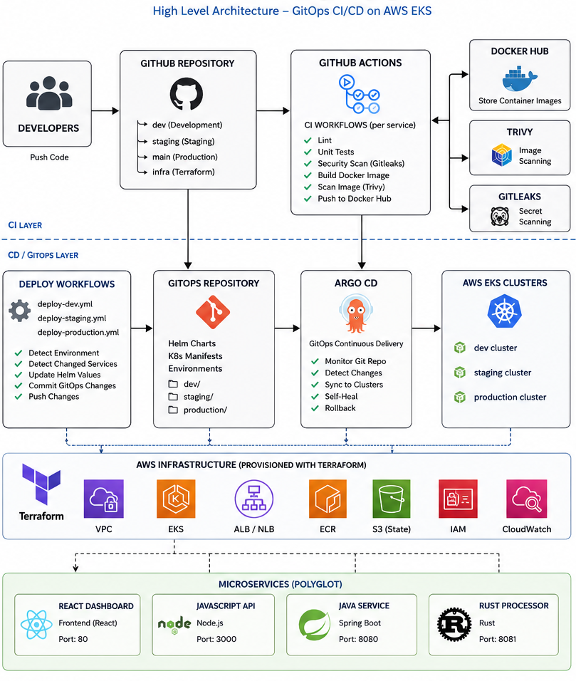

```text
Developer
    │
    ▼
GitHub
    │
    ▼
GitHub Actions
    │
    ├── Security Scans
    ├── Unit Tests
    ├── Docker Build
    └── Image Push
    │
    ▼
GitOps Repository Update
    │
    ▼
ArgoCD
    │
    ▼
AWS EKS Cluster
    │
    ├── React Dashboard
    ├── JavaScript API
    ├── Java Service
    └── Rust Processor
```

---

# Technology Stack

| Category      | Technology                        |
| ------------- | --------------------------------- |
| Cloud         | AWS                               |
| Containers    | Docker                            |
| Orchestration | Kubernetes (EKS)                  |
| GitOps        | ArgoCD                            |
| IaC           | Terraform                         |
| Packaging     | Helm                              |
| CI/CD         | GitHub Actions                    |
| Frontend      | React                             |
| Backend       | Node.js                           |
| Backend       | Java Spring Boot                  |
| Backend       | Rust                              |
| Security      | Trivy, Gitleaks, Semgrep, Checkov |
| Monitoring    | Prometheus, Grafana               |

---

# Project Structure

```text
.
├── terraform/
├── helm/
│   ├── react-dashboard/
│   ├── javascript-api/
│   ├── java-service/
│   └── rust-processor/
│
├── polyglot-microservices/
│   ├── frontend/
│   └── backend/
│
├── k8s/
│   ├── bootstrap/
│   └── apps/
│
└── .github/workflows/
```

---

# Screenshots

### Operations Portal

The React Operations Portal provides a centralized view of platform health across all microservices.

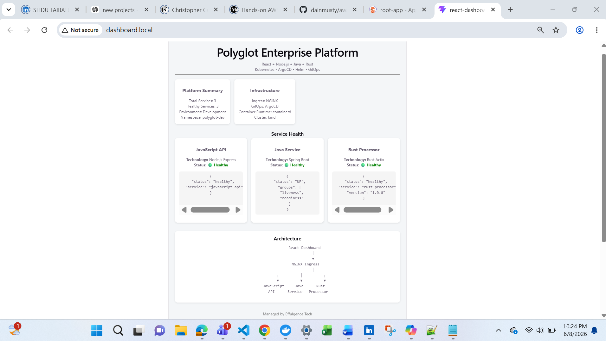

## GitHub Actions Pipelines

Independent CI/CD pipelines for React, Node.js, Java, and Rust services.

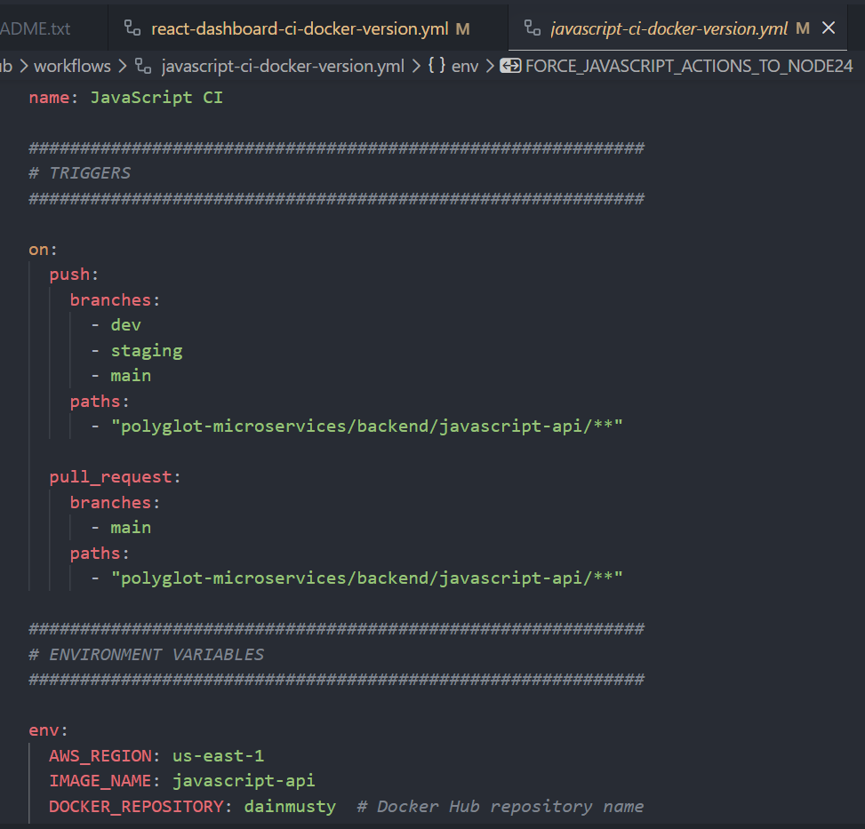

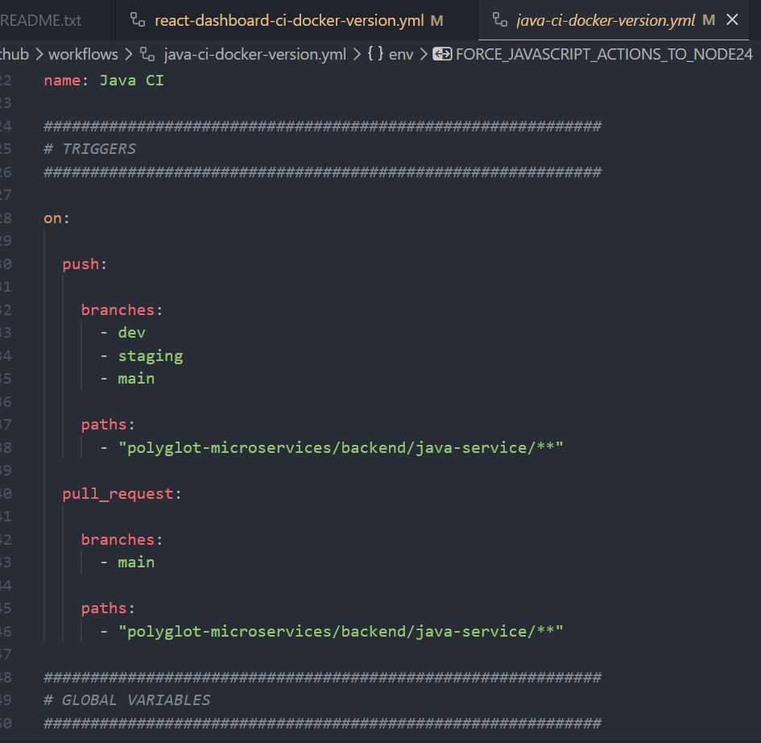

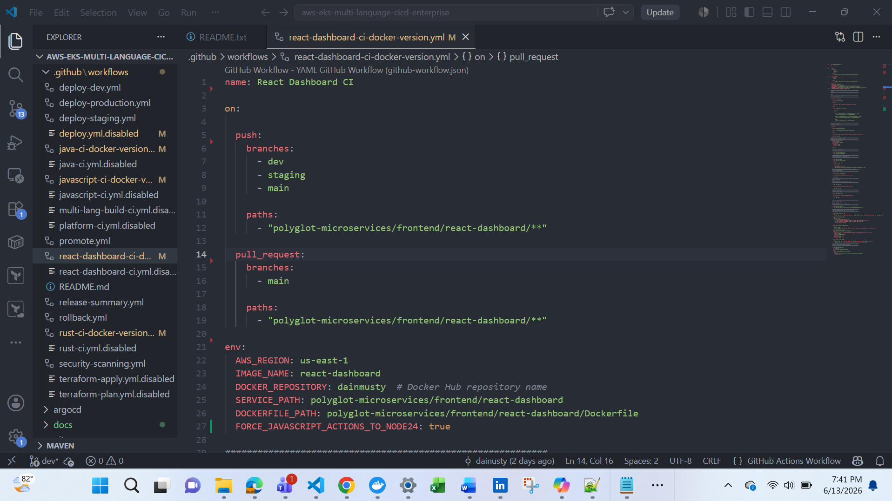

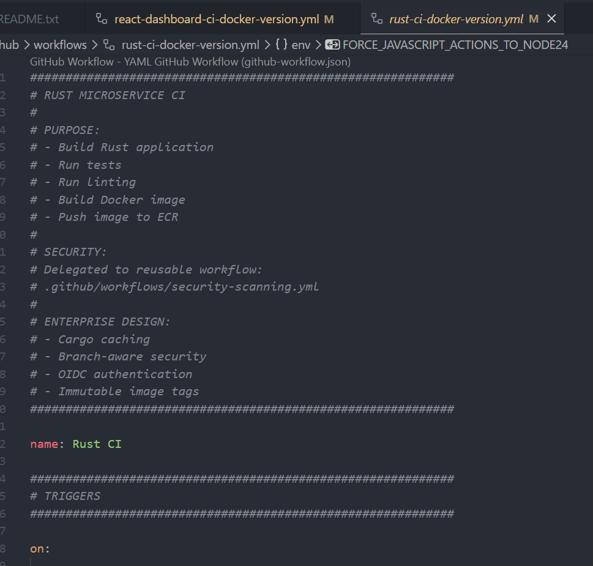

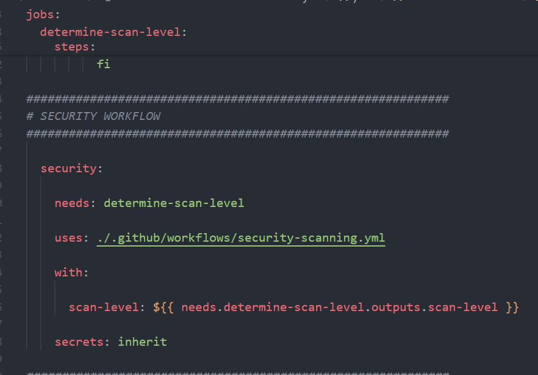

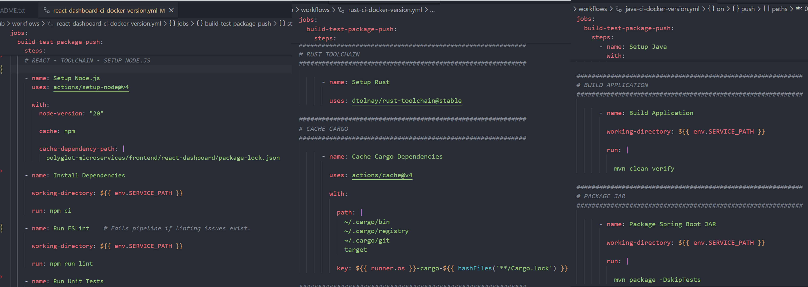

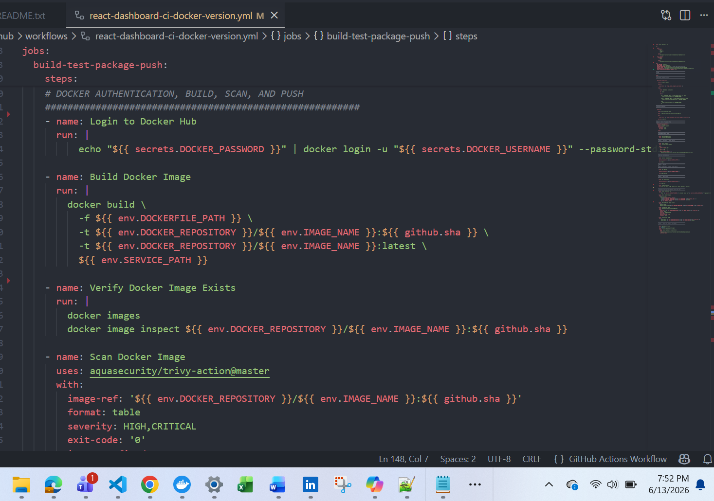

## ArgoCD Applications

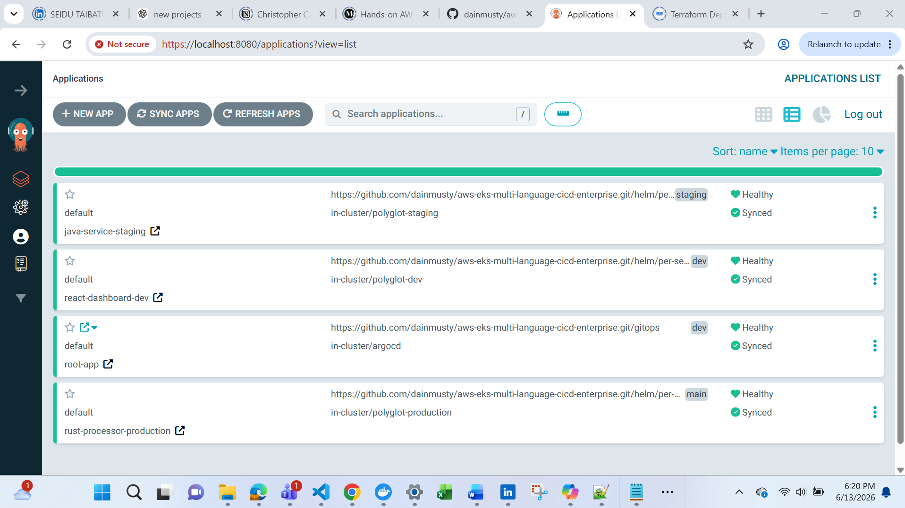

### Development Environment

All services successfully deployed and healthy in the development environment.

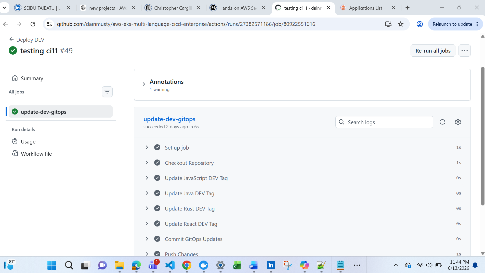


---

# CI/CD Architecture

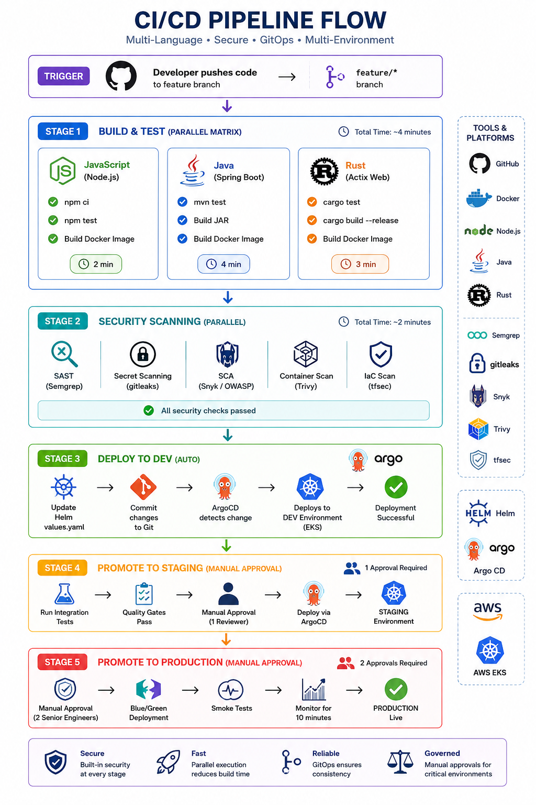

The platform implements service-specific CI pipelines.

```text
.github/workflows/

├── javascript-ci.yml
├── java-ci.yml
├── rust-ci.yml
├── react-ci.yml
├── deploy-dev.yml
├── deploy-staging.yml
├── deploy-production.yml
├── promote-release.yml
├── rollback.yml
└── release-summary.yml
```

Each service is independently built, tested, scanned, containerized, and deployed.

---

# Deployment Strategies

## Option A: Service-Specific CI Pipelines (Implemented)

```text
Developer Push
       │
       ▼
Language-Specific Pipeline
       │
       ├── Lint
       ├── Tests
       ├── Security Scan
       ├── Docker Build
       └── Docker Push
```

### Advantages

* Easier troubleshooting
* Clear ownership boundaries
* Faster onboarding
* Language-specific optimizations
* Better educational value
* Common enterprise pattern

### Disadvantages

* More workflow files
* Some duplicated logic
* Additional maintenance

### Best Use Cases

* Small and medium teams
* Polyglot environments
* Portfolio projects
* Microservice platforms

---

## Option B: Multi-Language Matrix Pipeline (Reference Architecture)

```text
Developer Push
       │
       ▼
Detect Changed Services
       │
       ▼
Parallel Matrix Builds
       │
       ├── Build
       ├── Scan
       └── Push
```

### Advantages

* Centralized governance
* Less duplicated code
* Better scaling

### Disadvantages

* Complex workflow logic
* Harder troubleshooting
* More difficult onboarding

### Best Use Cases

* Large organizations
* Platform engineering teams
* Internal developer platforms

---

## Project Recommendation

This project uses:

```text
Primary:
    Service-Specific Pipelines

Reference:
    Matrix-Based Pipeline
```

The service-specific model was selected because it offers the best balance between maintainability, clarity, scalability, and interview value.

---

# Security Strategy

Environment-aware security scanning is implemented.

---

## Development

```text
Branch:
    dev

Security:
    - Gitleaks
    - Basic Dependency Scanning

Goal:
    Fast Feedback
```

---

## Staging

```text
Branch:
    staging

Security:
    - Semgrep
    - OWASP Dependency Check
    - Cargo Audit
    - Checkov
    - Helm Lint

Goal:
    Pre-Production Validation
```

---

## Production

```text
Branch:
    main

Security:
    - Full Trivy Scan
    - SBOM Generation
    - Compliance Validation
    - Manual Approvals

Goal:
    Maximum Security
```

---

# GitOps Deployment Model

```text
Developer Push
        │
        ▼
GitHub Actions
        │
        ▼
Build Container Images
        │
        ▼
Push Images
        │
        ▼
Update Helm Values
        │
        ▼
Commit GitOps Changes
        │
        ▼
ArgoCD Sync
        │
        ▼
Kubernetes Deployment
```

---

# Environment Promotion Flow

```text
Feature Branch
      │
      ▼
DEV
      │
      ▼
STAGING
      │
      ▼
PRODUCTION
```

Each environment uses independent Helm values and deployment workflows.

---

# Rollback Strategy

## Git Revert (Recommended)

```bash
git revert <commit-id>
git push
```

ArgoCD automatically reconciles cluster state.

---

## ArgoCD Rollback

```bash
argocd app rollback <application>
```

---

## Helm Rollback

```bash
helm rollback <release> <revision>
```

---

# Monitoring & Observability

* Prometheus
* Grafana
* Kubernetes Metrics
* Node Exporter
* Application Health Checks

---

# Key Features

* AWS EKS Kubernetes Platform
* GitOps with ArgoCD
* Terraform Infrastructure as Code
* Helm Deployments
* Multi-Language Microservices
* Environment Promotion Pipelines
* Automated Security Scanning
* Docker Image Lifecycle Management
* Enterprise Deployment Workflows
* Rollback Automation

# Architectural Decisions & Tradeoffs

This project intentionally follows several enterprise design patterns that prioritize scalability, team autonomy, operational safety and GitOps-driven deployments.

---
## Multi-Language Microservices Architecture
The platform consists of:

* React Dashboard
* JavaScript API (Node.js / Express)
* Java Service (Spring Boot)
* Rust Processor (Actix Web)

### Why This Approach?

Large organizations rarely standardize on a single programming language. Different teams often select technologies best suited for their domain requirements.

This project simulates a realistic enterprise environment where multiple development teams contribute services built with different technology stacks.

### Benefits

| Benefit                 | Description                                                           |
| ----------------------- | --------------------------------------------------------------------- |
| Team Autonomy           | Teams can choose the most appropriate language and framework.         |
| Independent Deployments | Services can be released separately without impacting others.         |
| Technology Diversity    | Allows evaluation of different performance and development tradeoffs. |
| Faster CI/CD            | Only modified services are rebuilt and redeployed.                    |
| Reduced Blast Radius    | Failures are isolated to a single service.                            |
| Better Scalability      | Services can scale independently.                                     |

### Tradeoffs

| Tradeoff               | Description                                                |
| ---------------------- | ---------------------------------------------------------- |
| More CI Pipelines      | Each language requires dedicated build and test workflows. |
| More Docker Images     | Additional image lifecycle management.                     |
| Operational Complexity | Monitoring and troubleshooting become more complex.        |
| Knowledge Requirements | Teams need expertise across multiple technologies.         |
| Governance Overhead    | Platform standards become more important.                  |

### Enterprise Mitigations

* Shared GitHub Actions workflows
* Reusable security scanning pipeline
* Standardized Helm chart structure
* Centralized observability platform
* GitOps-based deployment strategy

---

## Per-Service Helm Chart Strategy

Each microservice owns its own Helm chart.

```text
helm/
├── javascript-api/
├── java-service/
├── rust-processor/
└── react-dashboard/
```

### Benefits

| Benefit               | Description                                     |
| --------------------- | ----------------------------------------------- |
| Independent Releases  | Services can be upgraded individually.          |
| Independent Rollbacks | Problems can be isolated and reversed quickly.  |
| Team Ownership        | Each team manages its own deployment lifecycle. |
| GitOps Friendly       | ArgoCD can track services independently.        |
| Better Scalability    | Easier to onboard new services.                 |

### Tradeoffs

| Tradeoff                 | Description                               |
| ------------------------ | ----------------------------------------- |
| More Charts              | Additional maintenance overhead.          |
| Version Management       | Multiple chart versions must be managed.  |
| Standardization Required | Teams must follow deployment conventions. |

### Enterprise Mitigations

* Shared chart templates
* Helm linting in CI
* ArgoCD Application management
* Standardized deployment patterns

---

# Learning Outcomes

This project demonstrates practical experience with:

* Kubernetes Administration
* AWS EKS Operations
* Terraform
* GitHub Actions
* GitOps
* ArgoCD
* Helm
* Platform Engineering
* Security Automation
* Enterprise CI/CD Design

---

# Future Enhancements

* AWS Load Balancer Controller
* ExternalDNS
* Cert Manager
* Service Mesh (Istio)
* OpenTelemetry
* Multi-Region Deployments
* Policy-as-Code (OPA/Gatekeeper)
* Vault Integration
* Progressive Delivery with Argo Rollouts

```
```
